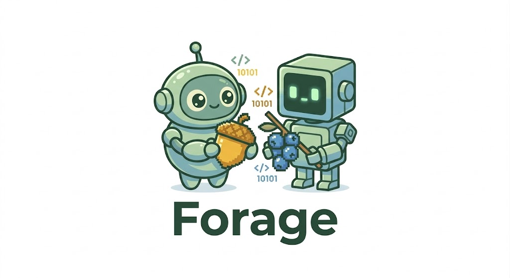
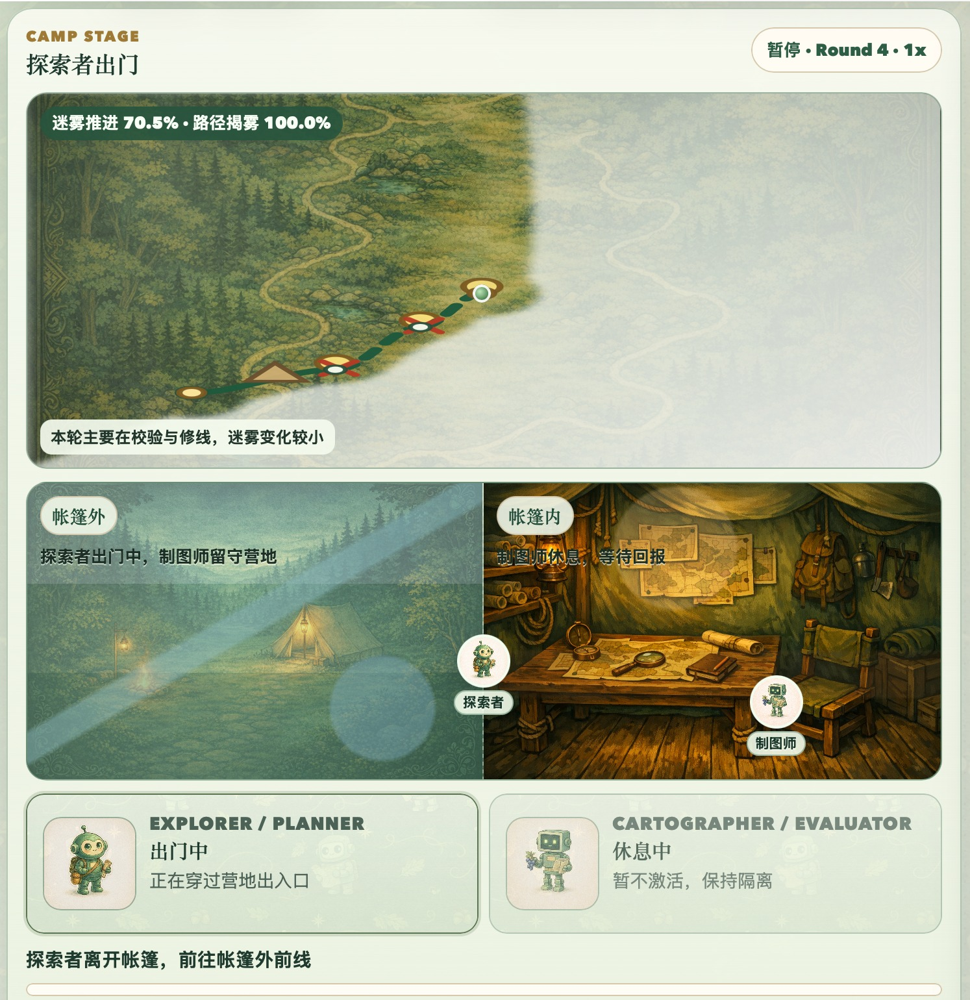
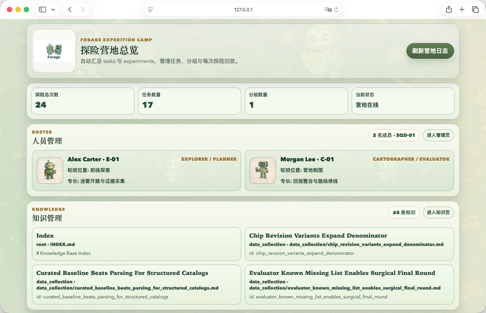

<p align="center">
  
</p>

<h3 align="center">Your basecamp for the unknown.</h3>

<p align="center">
  An autonomous agent architecture that accumulates and transfers experience<br>
  across runs, models, and task types.
</p>

<p align="center">
  <a href="https://sariel2018.github.io/forage-v2/"></a>
  <a href="https://arxiv.org/abs/TODO"></a>
  <a href="https://github.com/Sariel2018/forage"></a>
  <a href="https://github.com/Sariel2018/forage-v2/blob/main/LICENSE"></a>
</p>

---

## Highlights

- **Co-evolving evaluation** — No human-written criteria, no manual checkpoints. Evaluation standards are *discovered* by an independent agent and co-evolve with execution — fully autonomous from start to stop.
- **Method isolation** — The Evaluator and Planner cannot see each other's code. Physical workspace separation enforces audit independence.
- **Knowledge evolution** — After each run, agents extract transferable lessons. The next team inherits accumulated organizational wisdom.
- **Cross-model transfer** — A weaker model with a stronger model's knowledge converges 1.8x faster at 45% lower cost, arriving at the same answer three times independently.
- **Dual-agent primitive** — The Evaluator–Planner pair is a minimal composable unit. Multiple pairs can run in parallel across different tasks, feeding into a shared knowledge base.

---

## The problem

You ask an AI agent to do an open-ended task. It works for a while, declares victory, reports 100% complete. It found 15% of what exists.

We call this **denominator blindness** — the agent's numerator may be accurate, but it never discovered the denominator. Every current agent framework lets the agent grade its own work, and none of them catch this.

## What Forage does differently

Forage doesn't make individual agents stronger. It designs **institutions** — audit separation, contract protocols, organizational memory — that make ordinary agents reliable.

### Two agents, not one

One **explores** (the Planner), one **maps** (the Evaluator). They can't see each other's code — like an auditor who can't read the books they're auditing. The Evaluator doesn't check against a pre-written rubric. It *discovers* what "complete" means by independently exploring the problem space. Both evolve together.

### The organization remembers

After each run, both agents independently write down what they learned. The next team reads the notebook before heading out. Over six runs, the organization accumulates 54 knowledge entries — which sources are reliable, what pitfalls exist, how the domain is structured.

### Knowledge transfers across models

A weaker model, given a stronger model's accumulated knowledge, doesn't need to rediscover what the stronger model already knew.

## Key results

| | Without Forage | Forage V1 | Forage V2 |
|---|---|---|---|
| **Self-reported coverage** | 100% | — | — |
| **Actual coverage** | 15.9% | 98.8% | 99.7% |
| **Knows when it's done** | No | Yes | Yes |
| **Learns across runs** | No | No | Yes |

### V2 knowledge transfer (NVIDIA GPU benchmark)

| Metric | Sonnet (cold start) | Sonnet (with Opus knowledge) | Improvement |
|---|---|---|---|
| Coverage | 93.1% | 98.6% | +5.5pp |
| Rounds to converge | 7.0 | 4.5 | 1.8x faster |
| Cost per run | $9.40 | $5.13 | 45% cheaper |
| Denominator agreement | Scattered (320–411) | Converged (266) | 3 runs, same answer |

## Architecture

```
                    ┌─────────────────────────────────────────────┐
  Within a Run      │                                             │
                    │  ┌───────────┐   shared    ┌───────────┐   │
                    │  │ Evaluator │◄──────────►│  Planner  │   │
                    │  │ (eval.py) │  artifacts  │(action.py)│   │
                    │  └───────────┘             └───────────┘   │
                    │        ✗ no mutual code visibility ✗        │
                    └─────────────────────────────────────────────┘
                                        │
                                   post-mortem
                                        ▼
                    ┌─────────────────────────────────────────────┐
  Across Runs       │            Knowledge Base                   │
                    │  ┌───────┐ ┌───────┐       ┌───────┐      │
                    │  │ Run 1 │ │ Run 2 │  ...  │ Run N │      │
                    │  └───────┘ └───────┘       └───────┘      │
                    │                    │                        │
                    │              transfer ───► Sonnet (seeded) │
                    └─────────────────────────────────────────────┘
```

**Method isolation** is the core invariant. The Evaluator writes `eval.py` (how to measure); the Planner writes `action.py` (how to execute). Neither can read the other's script. They coordinate through a public `eval_contract.md` — like an auditor's terms of engagement. V2 enforces this through **physical workspace separation** — each agent runs in its own directory with no access to the other's files.

## Verified across task types

| Task | Domain | Tool | What it tests |
|---|---|---|---|
| NVIDIA Desktop GPUs | Web scraping | Browser | Data collection at scale (265–411 candidates) |
| UniProt T2D Proteins | API queries | REST API | Tool generalization (28–30 candidates) |
| Q10 Mathematical Proof | Reasoning | Code execution | Non-collection task type |
| Q6 Mathematical Proof | Hard reasoning | Code execution | Capability boundary |

## Quick start

```bash
# Prerequisites: Python 3.11+, Claude Code CLI (https://claude.ai/code)
pip install -e .

# Run a single task
forage run tasks/nvidia_gpu.yaml

# Run a 6-run learning curve experiment
forage experiment tasks/nvidia_gpu.yaml
```

## Project structure

```
forage/
├── agents/              # Evaluator, Planner, Executor implementations
│   ├── evaluator.py     #   Discovers what "complete" means
│   ├── planner.py       #   Decides how to execute
│   └── executor.py      #   Runs agent scripts (non-LLM)
├── core/
│   ├── loop.py          #   Multi-round Evaluator→Planner→Executor loop
│   ├── workspace.py     #   Physical isolation (eval_ws/ ↔ plan_ws/)
│   ├── knowledge.py     #   Post-mortem extraction & knowledge accumulation
│   ├── trajectory.py    #   Per-round state tracking
│   └── spec.py          #   Task spec loader (YAML)
└── experiments/
    ├── runner.py         #   Multi-run experiment orchestration
    ├── learning_curve.py #   Cross-run learning analysis
    └── single_agent.py   #   Baseline: single agent without Forage
tasks/                    # Task specifications (YAML)
tests/                    # 72 tests
```

## The vision

<p align="center">
  
  <br>
  <em>Your basecamp awaits.</em>
</p>

<p align="center">
  
  <br>
  <em>Fog clears as the team explores. The explorer ventures out; the cartographer holds the camp.</em>
</p>

<p align="center">
  
  <br>
  <em>Expedition management, team roster, knowledge assets.</em>
</p>

## Roadmap

```
V1  Expedition     →  Two agents establish credible judgment
V2  Organization   →  Experience accumulates and transfers         ← you are here
V3  Basecamp       →  A camp manager allocates resources dynamically
V4  Highway        →  Verified routes crystallize into reusable pipelines
```

**V1** solved the single-run problem: how do you know the agent actually finished? ([paper](https://arxiv.org/abs/TODO) | [code](https://github.com/Sariel2018/forage))

**V2** solves the multi-run problem: how does the organization learn? ([paper](https://arxiv.org/abs/TODO))

**V3** will add a camp manager that dynamically allocates resources — adjusting turn budgets, swapping models, and curating the knowledge base based on accumulated experience.

**V4** will crystallize verified routes into reusable pipelines — the trails blazed by explorers become highways for everyone.

## Status

The V2 paper has been submitted to arXiv. This is a research prototype — contributions and feedback are welcome.

## Citation

```bibtex
@article{foragev2,
    title={Forage V2: Knowledge Evolution and Transfer
           in Autonomous Agent Organizations},
    author={Xie, Huaqing},
    journal={arXiv preprint},
    year={2026}
}
```

## License

MIT
